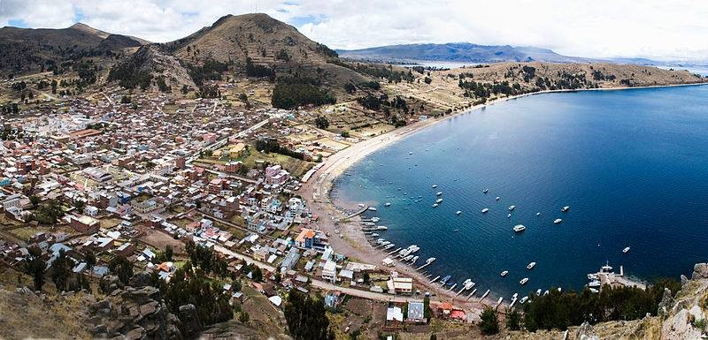
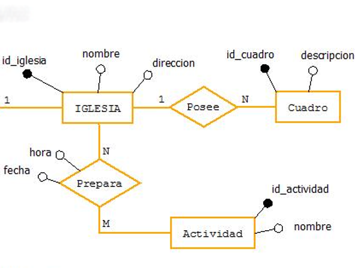
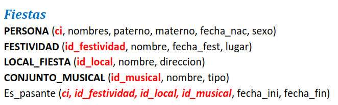
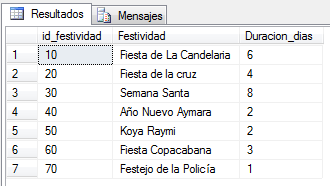
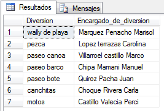

# Festividad de Copacabana - E-R y Relacional


En este proyecto se realiza la creación de un modelo **Entidad-Relación** y un modelo **Relacional**, para luego implementarlo al gestor de base de datos: **Microsoft SQL Server** a través de _Scripts_, y que además se tienen ejemplos de consultas **SQL**.

<p align="center">
  
</p>

Para el desarrollo e implementación del proyecto se tienen las siguientes fases o etapas a considerar:
* Modelado ER
* Modelo Relacional
* Creación de Scripts SQL: tablas y datos
* Consultad SQL, como ejemplos de la implementación


## Modelo Entidad-Relación
Para diseñar el modelo Entidad-Relación se consideró las siguientes áreas o campos de estudio, tales como:

- _Fiestas_
- _Diversiones_
- _Lugares turísticos_
- _Hoteles o albergues_
- _Restaurantes_
- _Transporte_
- _Iglesias_

En primera instancia se diseñó el modelo Entidad-Relación a lápiz y papel, para luego implementarlo a un software de diseño de diagramas, denominado **Dia**.

<p align="center">
  
</p>

- [x] Ingresar a la carpeta **"0_Modelo_ER"**, para ver el diseño completo del modelo Entidad-Relación.


## Modelo Relacional
En esta fase se construyó el modelo Relacional a partir del modelo Entidad-Relación, considerando las ENTIDADES (_en forma de rectángulo_) y RELACIONES (_en forma de rombo_), donde se abstraen los siguientes campos:

- Llave primaria
- Atributo
- Llave foránea

Como ejemplo tenemos el área de Fiestas:

<p align="center">
  
</p>

- [x] Ingresar a la carpeta **“1_Modelo_Relacional”**, para ver el desarrollo completo del modelo Relacional.


## Creación de los Scripts SQL📑
La siguiente fase es implementar una base de datos (_Festividad de Copacabana_), creando las **tablas** en lenguaje SQL para el gestor de base de datos **Microsoft SQL Server** en función del **modelo Relacional**, visto en el apartado anterior.

```sql
-- creando la tabla PERSONA:

CREATE TABLE PERSONA(

	ci        int not null,
	nombres   varchar(50),
	paterno   varchar(50),
	materno   varchar(50),
	fecha_nac date,
	sexo      varchar(50),
  
	CONSTRAINT ci_PK PRIMARY KEY(ci)
)
```

Luego crear los **INSERT’s** con sus datos respectivos, para cada uno de las tablas creadas.

```sql
-- Tabla PERSONA:

INSERT INTO PERSONA VALUES (8463792,'Ana','Carrasco','Carra','2001-12-01','Femenino');
INSERT INTO PERSONA VALUES (8345267, 'Pablo', 'Gutierrez','Mesa','1988-02-09', 'Masculino');
INSERT INTO PERSONA VALUES (4536279, 'Juan', 'Perez','Aviles', '1981-09-08', 'Masculino');
```

- [x] Ingresar a la carpeta **“2_Creacion_de_Tablas_y_llenado_SCRIPT”**, para ver los Scripts completos de _Tablas_ e _Inserts_.


## Consultas SQL
En esta fase se tienen algunos ejemplos de consultas SQL con el fin de verificar la implementación de la base de datos Relacional: Festividad de Copacabana; tales como:

1. **Desplegar el tiempo de duración de estas festividades.**

***Código:***

```sql
SELECT distinct id_festividad, dbo.obt_nombre_festividad(id_festividad) Festividad,
DAY(fecha_fin) - DAY(fecha_ini) + 1 Duracion_dias
FROM es_pasante
```

**_Captura:_**

<p align="center">
  
</p>


2. **¿Quiénes son los encargados de ofrecer estas diversiones?**

***Código:***

```sql
SELECT d.nombre Diversion, dbo.obt_nombre_persona(e.ci_encargado) Encargado_de_diversion
FROM encargado e, diversion d
WHERE e.id_diversion = d.id_diversion
```

***Captura:***

<p align="center">
  
</p>

- [x] Para ver más ejemplos ingresar a la carpeta **“3_Consultas_SQL”**.


